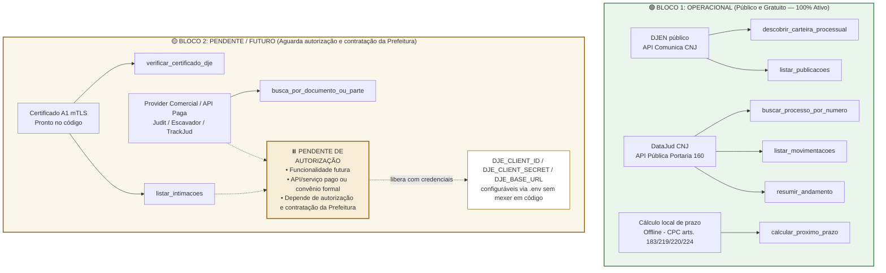

# Roadmap — MCP Jurídico Brasil (Pradópolis)

Documento de retomada. Estado real em 02/09/2026, para continuar em outra sessão.

## Grafo de arquitetura e dependências



## Estado dos blocos

### 🟢 O que está pronto, testado e em operação imediata
Estes blocos não dependem de contratação, mensalidade ou chaves pagas. Funcionam com as APIs públicas do Judiciário e cálculo local offline:

| Item | Ferramentas | Fonte / Regra | Status |
|---|---|---|---|
| **Descoberta de carteira** | `descobrir_carteira_processual` | DJEN / Comunica CNJ (público) | ✅ Operacional |
| **Feed de publicações** | `listar_publicacoes` | DJEN / Comunica CNJ (público) | ✅ Operacional |
| **Consulta processual** | `buscar_processo_por_numero` | DataJud CNJ (público) | ✅ Operacional |
| **Andamentos** | `listar_movimentacoes`, `resumir_andamento` | DataJud CNJ (público) | ✅ Operacional |
| **Cálculo de prazos** | `calcular_proximo_prazo` | Arts. 183, 219, 220, 224 CPC | ✅ Operacional |
| **Validação A1** | `verificar_certificado_dje` | Leitor local de `.pfx` mTLS | ✅ Operacional (14 testes) |
| **Console de testes** | `http://127.0.0.1:8777` | Servidor Starlette local | ✅ Operacional |
| **Painel visual** | `painel-pradopolis-local.html` | Interface do Jurídico Pradópolis | ✅ Operacional |

**Total de 286 testes passando, ruff e mypy --strict limpos.**

---

### ⏸️ Funcionalidade futura / Deixada pendente (APIs Pagas e DJe Oficial)

> **Decisão de projeto:** Este módulo fica oficialmente **pausado/pendente**.
> Será configurado futuramente assim que a Prefeitura de Pradópolis autorizar e formalizar a contratação do serviço/API paga e o credenciamento institucional.

* **O que compreende:**
  1. `listar_intimacoes` (Domicílio Judicial Eletrônico com ciência formal via CNJ PDPJ).
  2. Providers comerciais pagos (Judit, Escavador ou TrackJud para recuperação de acervo passivo anterior a 2024).
* **Motivo da pausa:** Requer autorização administrativa e contratação onerosa pela Prefeitura. O código já está 100% arquitetado e desacoplado — quando a contratação ocorrer, bastará inserir as chaves e os endpoints no arquivo `.env`, sem necessidade de refatoração do sistema.

---

## Pendências de código (refinamentos)

1. **DL 779/69 no painel fiscal** (`painel-fiscal-pradopolis-main/backend/app/juridico/prazo.py`) — alinhar o cálculo do rito trabalhista no painel fiscal com a regra já ajustada no MCP.
2. **Timeout no DJEN** (`comunica/client.py:38`) — elevar de 45s para 90s com política de retry para períodos de alta concorrência na API do CNJ.
3. **Cosmético**: Atualizar contagem de tribunais no README para refletir exatamente os 92 dicionários suportados.

---

## Como retomar e testar

```bash
cd /Users/samuelpulcini/Downloads/mcp-juridico-brasil-main
uv run --extra dev pytest -q          # executa os 286 testes automatizados
uv run python scripts/console_local.py # abre o console em http://127.0.0.1:8777
```

