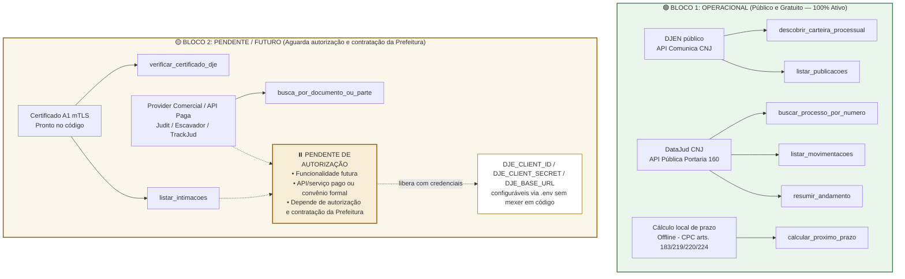

# Roadmap — MCP Jurídico Brasil (Pradópolis)

Documento de retomada. Estado real em 02/09/2026, para continuar em outra sessão.

## Grafo de arquitetura e dependências



## Estado dos blocos

### 🟢 O que está pronto, testado e em operação imediata
Estes blocos não dependem de contratação, mensalidade ou chaves pagas. Funcionam com as APIs públicas do Judiciário e cálculo local offline:

| Item | Ferramentas | Fonte / Regra | Status |
|---|---|---|---|
| **Descoberta de carteira** | `descobrir_carteira_processual` | DJEN / Comunica CNJ (público) | ✅ Operacional |
| **Feed de publicações** | `listar_publicacoes` | DJEN / Comunica CNJ (público) | ✅ Operacional |
| **Consulta processual** | `buscar_processo_por_numero` | DataJud CNJ (público) | ✅ Operacional |
| **Andamentos** | `listar_movimentacoes`, `resumir_andamento` | DataJud CNJ (público) | ✅ Operacional |
| **Cálculo de prazos** | `calcular_proximo_prazo` | Arts. 183, 219, 220, 224 CPC | ✅ Operacional |
| **Validação A1** | `verificar_certificado_dje` | Leitor local de `.pfx` mTLS | ✅ Operacional (14 testes) |
| **Console de testes** | `http://127.0.0.1:8777` | Servidor Starlette local | ✅ Operacional |
| **Painel visual** | `painel-pradopolis-local.html` | Interface do Jurídico Pradópolis | ✅ Operacional |

**Total de 357 testes passando (297 no MCP, 60 no backend), ruff e mypy limpos.**

### 🟢 Hermes — avisos no Telegram (Task 3, concluída em 03/09/2026)

| Item | Onde | Status |
|---|---|---|
| Resumo diário 08:00 no grupo | `backend/app/hermes/agendador.py` | ✅ Verificado |
| Alerta crítico no privado | idem | ✅ Verificado |
| Filtro de LGPD (nenhum nome de pessoa natural) | `hermes/formatador.py` | ✅ 5 testes |
| Não-repetição garantida pelo banco | índice parcial `uq_hermes_chave` | ✅ Provado em SQL |
| Opt-in por código, dois fatores | `hermes/webhook.py` + tela do painel | ✅ Ponta a ponta |
| Botão "Marcar como visto" | callback do webhook | ✅ Grava triagem e auditoria |

**Pendente:** nada foi exercitado contra a Bot API real — a verificação usou um Telegram
simulado local. Falta criar o bot no `@BotFather`, configurar `TELEGRAM_BOT_TOKEN` e
`PAINEL_BASE_URL` públicos e chamar `POST /hermes/webhook/registrar`. O webhook exige
HTTPS em URL pública; em `localhost` o Telegram não entrega. Ver `backend/DEPLOY.md`, §6.

---

### ⏸️ Funcionalidade futura / Deixada pendente (APIs Pagas e DJe Oficial)

> **Decisão de projeto:** Este módulo fica oficialmente **pausado/pendente**.
> Será configurado futuramente assim que a Prefeitura de Pradópolis autorizar e formalizar a contratação do serviço/API paga e o credenciamento institucional.

* **O que compreende:**
  1. `listar_intimacoes` (Domicílio Judicial Eletrônico com ciência formal via CNJ PDPJ).
  2. Providers comerciais pagos (Judit, Escavador ou TrackJud para recuperação de acervo passivo anterior a 2024).
* **Motivo da pausa:** Requer autorização administrativa e contratação onerosa pela Prefeitura. O código já está 100% arquitetado e desacoplado — quando a contratação ocorrer, bastará inserir as chaves e os endpoints no arquivo `.env`, sem necessidade de refatoração do sistema.

---

## ⚠️ Bloqueio conhecido: o DJEN recusa datacenter estrangeiro

Descoberto em 03/09/2026, no primeiro deploy em produção (Render, região EUA).

| Origem | DJEN responde |
|---|---|
| Máquina local (Brasil) | ✅ 200 — 337 comunicações |
| Render (EUA) | ❌ **403 · server=CloudFront** |

Testado com e sem `User-Agent` de navegador: **o 403 é idêntico**, logo o bloqueio
é do IP, não do cabeçalho. Nenhum ajuste de cliente resolve.

**O que continua funcionando no Render:** tudo, menos a varredura. O painel, o
login, a agenda, os relatórios e o Hermes (resumo e alertas) só dependem do banco
e do Telegram, e ambos respondem — confirmado por `GET /cron/diagnostico`.

**Saídas possíveis, em ordem de preferência:**

1. **Hospedar no Brasil.** Resolve na origem. Render não tem região brasileira;
   Fly.io tem `gru` (São Paulo), e provedores nacionais também servem — o mesmo
   `Dockerfile` roda em qualquer um.
2. **Varrer da rede da Prefeitura.** Uma máquina do Departamento roda a varredura
   e envia o resultado ao serviço. É o acesso mais legítimo possível: o próprio
   ente consultando as publicações dele, do IP dele.
3. **Acionar do GitHub Actions**, se o runner passar — a testar com o workflow
   `diagnostico-djen.yml`, que roda à mão e responde essa pergunta em um minuto.

Enquanto não se decide, a varredura pode ser disparada da máquina local:

```bash
cd backend && DATABASE_URL="<string do Neon>" uv run python -c "
import asyncio
from app.core.db import get_sessionmaker
from app.services.acervo import varrer_e_persistir
async def m():
    async with get_sessionmaker()() as s: print(await varrer_e_persistir(s))
asyncio.run(m())"
```

## Pendências de código (refinamentos)

1. **DL 779/69 no painel fiscal** (`painel-fiscal-pradopolis-main/backend/app/juridico/prazo.py`) — alinhar o cálculo do rito trabalhista no painel fiscal com a regra já ajustada no MCP.
2. ~~**Timeout no DJEN**~~ — **resolvido em 03/09/2026.** A varredura do backend passa
   `timeout=90.0` ao construir o `ComunicaClient` (`backend/app/services/acervo.py`). O
   padrão de 45s do MCP fica intocado: quem tem varredura de 2000 itens é o serviço, não
   a biblioteca. O retry com backoff já existia no agendador.
3. **Cosmético**: Atualizar contagem de tribunais no README para refletir exatamente os 92 dicionários suportados.

---

## Como retomar e testar

```bash
cd /Users/samuelpulcini/Downloads/mcp-juridico-brasil-main
uv run --extra dev pytest -q          # executa os 286 testes automatizados
uv run python scripts/console_local.py # abre o console em http://127.0.0.1:8777
```

