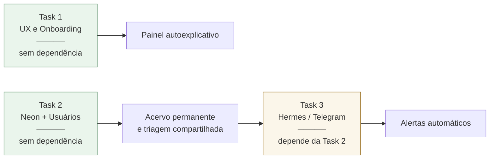

# Tasks de evolução — Painel Jurídico Pradópolis

Três tasks independentes em escopo, encadeadas em dependência. Nenhuma depende do
DJe autenticado nem de API paga — tudo em cima do que já está operacional (ver
`ROADMAP.md`, Bloco 1).

| Task | Persona | Dependência | Entrega |
|---|---|---|---|
| [1 — UX e Onboarding](TASK-1-UX-ONBOARDING.md) | Designer sênior de produto | nenhuma | Tour, tooltips jurídicos, estados vazios que ensinam |
| [2 — Backend e Neon](TASK-2-BACKEND-NEON.md) | Dev backend sênior | nenhuma | Banco, login, papéis, varredura 06:00, roteamento por OAB, relatórios |
| [3 — Hermes / Telegram](TASK-3-TELEGRAM-HERMES.md) | Integração e mensageria | **Task 2** | Resumo diário 08:00 e alerta crítico no privado |

**Ordem sugerida:** Task 1 e Task 2 podem correr em paralelo — não se tocam. A Task 3
só começa com a Task 2 fechada, porque sem banco o bot não sabe o que já avisou e vira
spam.

**Metodologia:** cada task é dividida em ciclos fechados. Um ciclo entrega algo
utilizável, passa por verificação explícita no navegador ou em teste, e só então o
próximo começa. Ciclo que falha na verificação repete antes de avançar.
