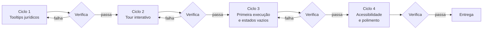

# Task 1 — Onboarding, Tutorial e Pedagogia na Interface

**Persona de execução:** Designer sênior de produto / UX, especializado em ferramentas
de trabalho densas para usuários que não são técnicos.

**Alvo:** `painel-pradopolis-local.html` (arquivo único, autocontido, ~626 KB).

**Dependências:** nenhuma. Não depende de banco, de login, do DJe nem de API paga.
Pode ser feita hoje, isoladamente, e entrega valor sozinha.

---

## 1. O problema real que esta task resolve

O painel hoje é competente e mudo. Ele mostra "Prazo 91 dias · 15 × 4" e presume que
quem lê sabe por que 15 virou 60. Sabe o procurador que acompanhou a construção —
não sabe o estagiário que entra na segunda-feira, nem o assessor que abre a tela
pela primeira vez às 8h com quatro coisas na cabeça.

Três lacunas concretas, observadas nos dados reais de Pradópolis:

1. **O prazo em dobro parece mágica.** `15 × 4` sem explicação é um número que o
   usuário ou aceita cegamente ou desconfia — os dois são ruins num sistema de prazo.
2. **A data de disponibilização é contraintuitiva.** Todo advogado sabe contar prazo,
   e a primeira reação ao ver "disponibilização 02/09 → publicação 03/09" é achar que
   o sistema errou. É o art. 224, §2º, e precisa estar dito na tela.
3. **A tela abre vazia de sentido.** Não há primeiro passo. O usuário novo não sabe se
   começa pelo Painel, pelas Publicações ou pela Carteira.

> **Princípio que rege esta task:** a interface não deve apenas informar o resultado —
> deve ensinar a regra que produziu o resultado. Num sistema de prazo, confiança não
> se pede, se demonstra.

---

## 2. Diretrizes de design (não negociáveis)

Herdadas do painel atual, para não quebrar a identidade já construída:

| Elemento | Valor |
|---|---|
| Acento | `--accent` verde-petróleo `#0F4C4A` (claro) / `#57B8AB` (escuro) |
| Tipografia | Zilla Slab (títulos) · IBM Plex Sans (corpo) · IBM Plex Mono (dados) |
| Severidade | crítico `#A32F26` · atenção `#8A5A00` · no prazo `#3E7C4F` |
| Temas | Três estados: `data-theme="dark"`, `="light"`, e o não-marcado (sistema) |

**Regras de execução:**

- **Zero dependências novas.** O painel é um arquivo único que abre com duplo clique,
  inclusive sem internet. Nada de `driver.js`, `intro.js` ou similar — o tour é escrito
  à mão (~180 linhas), e isso é uma decisão de arquitetura, não preguiça.
- **Nenhum modal bloqueante na abertura.** Quem já conhece o painel não pode ser
  obrigado a fechar uma caixa toda manhã.
- **Acessibilidade real:** navegação por teclado no tour (Tab, Esc, setas), `aria-live`
  nos passos, foco visível, e respeito a `prefers-reduced-motion`.
- **Ensinar no ponto de uso.** Tooltip ao lado do dado que ela explica — não numa
  página de ajuda que ninguém abre.

---

## 3. Metodologia em loop

Cada ciclo é fechado: entrega algo utilizável, é verificado no navegador, e só então
o próximo começa. Se um ciclo falhar na verificação, ele repete antes de avançar.

---

### Ciclo 1 — Tooltips jurídicos no ponto de uso

**Objetivo:** todo número que resulta de uma regra legal explica a regra ao ser tocado.

**Componente a construir:** um `<button class="explica">` circular de 15px com "?",
que abre um popover ancorado. Um só componente, usado em todos os pontos.

**Os cinco pontos que recebem tooltip — e o texto exato de cada um:**

| Onde | Título | Corpo |
|---|---|---|
| Etapa "Publicação" da faixa de prazo | Por que a publicação é no dia seguinte | "O diário informa a data de **disponibilização**. O CPC considera publicado no primeiro dia útil seguinte (art. 224, §2º) — e o prazo só começa a correr no dia útil seguinte à publicação (art. 224, *caput*). São dois saltos, não um." |
| Etiqueta `15 × 2` | Prazo em dobro da Fazenda Pública | "O Município tem prazo em dobro para todas as suas manifestações processuais (art. 183, *caput*, do CPC). O prazo simples de 15 dias úteis passa a 30." |
| Etiqueta `15 × 4` | Prazo quádruplo na Justiça do Trabalho | "Na Justiça do Trabalho o prazo diferenciado **não vem do CPC**, e sim do Decreto-Lei 779/69: quádruplo para contestar (art. 1º, II) e dobro para recorrer (art. 1º, III)." |
| Etiqueta `prazo simples` quando é JEFP | Por que aqui não há dobro | "No Juizado Especial da Fazenda Pública não existe prazo diferenciado para a Fazenda (art. 7º da Lei 12.153/2009), o que afasta o dobro do art. 183." |
| Coluna "Polo" da Carteira | Posição do Município | "**Passivo** = o Município é réu, foi processado. **Ativo** = o Município é autor, processou. Em Pradópolis, 62% do acervo é passivo — o perfil típico de um jurídico municipal." |

**Verificação do ciclo:**
- [ ] Os cinco tooltips abrem por clique e por `Enter`/`Espaço`
- [ ] `Esc` fecha; clique fora fecha; abrir um fecha o anterior
- [ ] O popover não é cortado pela borda da tela em nenhuma posição (testar o último item da lista)
- [ ] Contraste do texto ≥ 4.5:1 nos dois temas

---

### Ciclo 2 — Tour interativo "Como usar o painel"

**Objetivo:** em 6 passos e menos de 90 segundos, o usuário novo entende o fluxo diário.

**Gatilho:** botão discreto "Como usar" na barra superior, ao lado do seletor de tema.
Auto-inicia **apenas na primeira visita** (`localStorage`), e mesmo assim de forma
dispensável — um passo 0 que diz "Quer um tour rápido de 1 minuto?" com Sim/Agora não.

**Os 6 passos, na ordem do trabalho real:**

1. **Painel** → "Comece o dia aqui. Estes dois números respondem se o dia está sob
   controle: prazos vencendo em 3 dias, e publicações que ninguém leu ainda."
2. **Publicações · lista** → "Sua fila de triagem. A bolinha verde marca o que ainda
   não foi lido. A etiqueta colorida à direita é o prazo: vermelha até 3 dias."
3. **Publicações · faixa de prazo** → "A memória de cálculo. Quatro marcos, do diário
   até o vencimento, com o artigo que justifica cada salto."
4. **Publicações · inteiro teor e link** → "O texto integral da publicação. **Sempre**
   confira no link do tribunal antes de peticionar."
5. **Publicações · triagem** → "Classifique e atribua um responsável. É isso que faz o
   resto da equipe saber o que já foi tratado."
6. **Prazos e Carteira** → "A agenda de vencimentos e o acervo completo, para o
   relatório semanal."

**Implementação:** overlay escuro com recorte (`clip-path` ou quatro divs de máscara),
balão posicionado com `getBoundingClientRect()`, e `scrollIntoView({block:"center"})`
antes de cada passo. Troca de tela via `location.hash` quando o passo exige.

**Verificação do ciclo:**
- [ ] O tour navega entre as telas sozinho e o destaque cai no elemento certo em cada uma
- [ ] Setas ←/→ avançam e voltam; `Esc` sai a qualquer momento
- [ ] Sair no meio não deixa overlay órfão nem trava o scroll da página
- [ ] Com `prefers-reduced-motion`, as transições viram cortes secos
- [ ] Rodar duas vezes seguidas funciona (estado limpo entre execuções)

---

### Ciclo 3 — Primeira execução e estados vazios que ensinam

**Objetivo:** nenhuma tela vazia diz apenas "nada aqui".

| Situação | O que a tela deve dizer |
|---|---|
| Busca sem resultado | "Nenhuma publicação com esses filtros." + botão "Limpar filtros" |
| Filtro "Prazo ≤ 3 dias" vazio | "Nenhum prazo crítico. O dia está sob controle." — é boa notícia, e deve soar como tal |
| Carteira vazia | "Rode uma varredura para descobrir os processos do Município." + o que é uma varredura, em uma linha |
| Nenhuma publicação lida ainda | Banner dispensável no topo: "Primeira vez? O tour leva 1 minuto." |

**Faixa educativa persistente** no topo da tela Publicações, dispensável e com memória:

> ⚖️ Os prazos aqui são calculados com o prazo diferenciado do ente público
> (arts. 183 e 224 do CPC; DL 779/69 no rito trabalhista). **Confira sempre no portal
> do tribunal antes de peticionar** — este painel é apoio, não controle oficial de prazo.

**Verificação do ciclo:**
- [ ] Cada estado vazio foi visto de fato no navegador, não apenas escrito
- [ ] O "dispensar" persiste após recarregar (e há como reexibir)
- [ ] `localStorage` indisponível (janela anônima) não quebra nada — tudo em `try/catch`

---

### Ciclo 4 — Acessibilidade e polimento

**Verificação final, item a item:**
- [ ] Navegação completa por teclado, do primeiro filtro ao último botão de triagem
- [ ] Foco visível em tudo que é interativo, nos dois temas
- [ ] Nenhuma informação transmitida **só** por cor (prazo crítico tem texto, não só vermelho)
- [ ] Zero erro no console em qualquer tela
- [ ] Testado em 1440px, 1024px e 768px
- [ ] Testado nos três estados de tema: claro, escuro e sistema

---

## 4. Critério de pronto

A task está completa quando **um estagiário que nunca viu o painel consegue, sozinho,
triar uma publicação e explicar em voz alta por que o prazo é de 60 dias** — sem
perguntar nada a ninguém.
