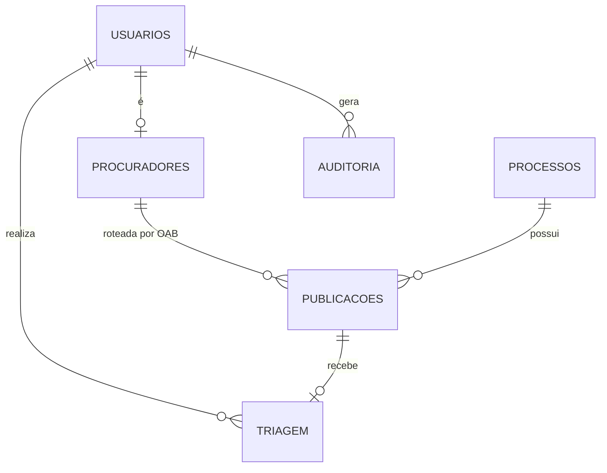

# Task 2 — Persistência, Usuários e Varredura Automática

**Persona de execução:** Desenvolvedor backend sênior. Prioriza correção sobre
velocidade, migração reversível e trilha de auditoria desde o primeiro dia — porque
o sistema lida com prazo processual e com dado pessoal de terceiros.

**Alvo:** novo serviço FastAPI + Neon PostgreSQL, consumindo as tools do MCP jurídico.

**Dependências:** nenhuma externa paga. Neon tem plano gratuito suficiente para o
volume de Pradópolis (229 processos, ~325 publicações/45 dias).

---

## 1. O problema real que esta task resolve

Hoje a triagem mora no `localStorage` do navegador de **uma** máquina. Consequências
concretas, não hipotéticas:

- O que o Procurador A marcou, o Procurador B não vê.
- Trocar de computador perde tudo. Limpar o navegador perde tudo.
- Não existe histórico de quem fez o quê — inaceitável num órgão público.
- O acervo não acumula: cada varredura recomeça, e processo sem publicação recente
  simplesmente desaparece da tela.

O banco não é "melhoria de performance". É o que transforma um visualizador em
sistema de gestão com responsabilidade rastreável.

---

## 2. Decisões de arquitetura, com o porquê

| Decisão | Escolha | Razão |
|---|---|---|
| Banco | **Neon PostgreSQL** | Gratuito no volume atual, gerenciado, `asyncpg` nativo, e *branching* de banco — dá para testar migração numa cópia antes de aplicar |
| Auth | **JWT com refresh** | Sem sessão em memória; o serviço pode reiniciar sem derrubar ninguém |
| Senhas | **Argon2id** | Padrão atual; bcrypt é aceitável, MD5/SHA é falha grave |
| Migrações | **Alembic** | Reversível. `CREATE TABLE IF NOT EXISTS` solto não sobrevive à segunda mudança de schema |
| Agendador | **APScheduler no processo** | Uma instância só; não vale a complexidade de Celery aqui |
| Fuso | **`America/Sao_Paulo` explícito** | Servidor em UTC faz "hoje" virar amanhã às 21h — bug já encontrado e corrigido no MCP |

> **Regra que atravessa toda a task:** nenhuma senha, token ou conteúdo de `.pfx`
> aparece em log, em `repr()` ou em mensagem de exceção. Isso é critério de aceite,
> não recomendação.

---

## 3. Modelo de dados

**Tabelas e o que cada uma resolve:**

- **`usuarios`** — `id`, `nome`, `email`, `senha_hash`, `papel`, `ativo`, `criado_em`.
  Papéis: `chefe`, `procurador`, `assessor`, `estagiario`.
- **`procuradores`** — `usuario_id`, `oab_numero`, `oab_uf`, `ativo`.
  É a chave do roteamento automático. Um usuário pode ter mais de uma OAB.
- **`processos`** — acervo permanente. `numero_processo` como PK, `tribunal`, `orgao`,
  `classe`, `polo_do_ente`, `partes_contrarias` e `advogados` em `jsonb`.
- **`publicacoes`** — imutável, veio do diário. Guarda o texto integral, o
  `ato_inferido`, o `rito_inferido` e o `vencimento` calculado.
- **`triagem`** — mutável, pertence ao departamento. Separada da publicação de
  propósito: mudar o status não pode reescrever o dado oficial.
- **`auditoria`** — `usuario_id`, `acao`, `entidade`, `entidade_id`, `detalhe` (jsonb),
  `ip`, `criado_em`. **Somente inserção** — sem UPDATE, sem DELETE.

**Índices que importam:** `publicacoes(vencimento)`, `publicacoes(numero_processo)`,
`publicacoes(data_disponibilizacao DESC)`, `triagem(responsavel_id, status)`.

---

## 4. Papéis e permissões

| Ação | Chefe | Procurador | Assessor | Estagiário |
|---|:--:|:--:|:--:|:--:|
| Ver todo o acervo | ✅ | — | ✅ | ✅ |
| Ver a própria carteira (por OAB) | ✅ | ✅ | ✅ | ✅ |
| Triar publicação | ✅ | ✅ | ✅ | ✅ |
| Atribuir responsável a outro | ✅ | — | — | — |
| Ver processo em segredo de justiça | ✅ | ✅ | — | — |
| Gerenciar usuários e OAB | ✅ | — | — | — |
| Disparar varredura manual | ✅ | ✅ | — | — |

Permissão é verificada **no backend**, sempre. Esconder botão no frontend é conforto,
não segurança.

---

## 5. Metodologia em loop

```mermaid
graph LR
    C1[Ciclo 1<br/>Schema + migrações] --> V1{Testes}
    V1 -->|falha| C1
    V1 -->|passa| C2[Ciclo 2<br/>Auth + papéis]
    C2 --> V2{Testes}
    V2 -->|falha| C2
    V2 -->|passa| C3[Ciclo 3<br/>Ingestão + acervo]
    C3 --> V3{Testes}
    V3 -->|passa| C4[Ciclo 4<br/>Roteamento por OAB]
    C4 --> V4{Testes}
    V4 -->|passa| C5[Ciclo 5<br/>Varredura noturna]
    C5 --> V5{Testes}
    V5 -->|passa| C6[Ciclo 6<br/>Relatórios PDF/Excel]
    C6 --> FIM[Entrega]
```

---

### Ciclo 1 — Schema e migrações

- Projeto Neon criado; `DATABASE_URL` só em `.env` (já coberto pelo `.gitignore`).
- Alembic inicializado; **migração inicial completa**, com `downgrade` funcional.
- Pool `asyncpg` no *lifespan* do FastAPI.

**Verificação:** `alembic upgrade head` seguido de `downgrade base` roda limpo, duas
vezes seguidas, sem resíduo.

---

### Ciclo 2 — Autenticação e autorização

- `POST /auth/login` → access (15 min) + refresh (7 dias).
- Dependência `requer_papel(*papeis)` aplicada rota a rota.
- Auditoria já gravando login, logout e falha de autenticação.

**Verificação:** um teste por linha da matriz de permissões da seção 4 — inclusive os
casos negativos, que são os que importam. Token expirado devolve 401, não 500.

---

### Ciclo 3 — Ingestão e acervo permanente

- Serviço que chama `descobrir_carteira_processual` e `listar_publicacoes` do MCP e
  persiste. `ON CONFLICT DO NOTHING` na publicação (ela é imutável), `ON CONFLICT DO
  UPDATE` no processo (ele evolui).
- **O prazo é recalculado na leitura, não lido do banco.** Assim, corrigir uma regra
  ou cadastrar um feriado municipal vale para todo o acervo, sem migração de dados.

**Verificação:** rodar a mesma varredura duas vezes não duplica nada e não perde nada.

---

### Ciclo 4 — Roteamento automático por OAB

Cruza a OAB da publicação com `procuradores.oab_numero`. Verificado com dados reais
de Pradópolis — o filtro discrimina bem:

| OAB | Publicações | Ligadas ao Município | Leitura |
|---|---|---|---|
| SP/274238 | 161 | 137 (**85%**) | procurador do ente |
| SP/325606 | 127 | 60 (47%) | atua para os dois lados |
| SP/201321 | 351 | 46 (13%) | advogado da parte contrária |

**Use esse percentual como sanidade do cadastro:** OAB cadastrada como do departamento
que vier com 13% foi cadastrada errado.

**Verificação:** publicação com OAB conhecida cai na mesa certa; com OAB desconhecida
vai para a fila do chefe, nunca some.

---

### Ciclo 5 — Varredura noturna

- APScheduler, dias úteis às **06:00 America/Sao_Paulo**.
- Timeout de 90s e retry com *backoff* — o DJEN responde em 10-16s sob concorrência,
  e o timeout atual de 45s já estourou em teste real.
- Registra início, fim, quantidade e falha em `auditoria`. Varredura que falhou em
  silêncio é pior que varredura que não rodou.

**Verificação:** simular timeout do DJEN e confirmar que o retry ocorre e que a falha
fica registrada.

---

### Ciclo 6 — Relatórios

- `GET /relatorios/pauta-semanal?formato=pdf|xlsx`
- Conteúdo: vencimentos dos próximos 7 dias úteis, agrupados por procurador, com
  processo, ato, rito e fundamento legal.
- PDF com `weasyprint` ou `reportlab`; Excel com `openpyxl`.

**Verificação:** o PDF gerado é legível impresso em A4 e os números batem com a tela.

---

## 6. Critério de pronto

Dois procuradores em máquinas diferentes veem a mesma triagem em tempo real; a
varredura das 06:00 rodou sozinha por cinco dias úteis seguidos; e a tabela de
auditoria responde "quem marcou esta publicação como protocolada, e quando".
