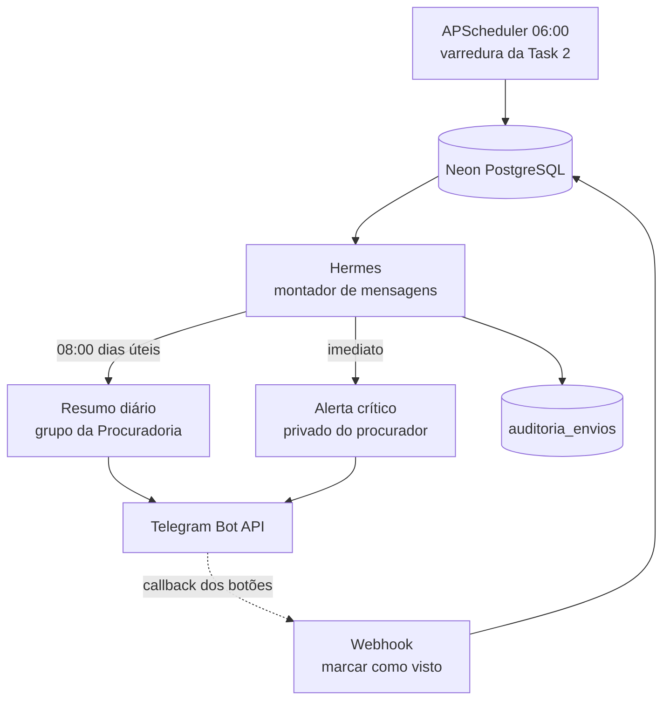
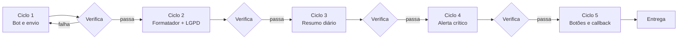

# Task 3 — Hermes: agente de notificação via Telegram

**Persona de execução:** Engenheiro de integração e mensageria, com cuidado explícito
de LGPD — o que trafega aqui é dado pessoal de terceiros em processo judicial.

**Nome do agente:** **Hermes** — o mensageiro. Não decide, não interpreta mérito,
não confirma leitura. Só leva o recado a tempo.

**Dependências:** Task 2 (banco e usuários) precisa estar pronta. Sem persistência
não há como saber o que já foi avisado, e o bot vira spam.

---

## 1. Por que Telegram, e não WhatsApp

A recomendação original citava Evolution API ou Z-API. Vale registrar o motivo da
escolha, porque a decisão tem consequência jurídica para um órgão público:

| Critério | Telegram Bot API | WhatsApp via Evolution/Z-API |
|---|---|---|
| Oficialidade | API oficial e documentada | Não oficial — automatiza o WhatsApp Web |
| Risco de banimento | Nenhum | **Real** — número da Prefeitura pode ser bloqueado |
| Custo | Gratuito | Mensalidade da API + infraestrutura |
| Termos de uso | Permite bots | Automação não oficial **viola os Termos do WhatsApp** |
| Setup | Minutos, via @BotFather | Sessão, QR Code, reconexões |

Para órgão público, usar automação que viola termos de serviço de terceiro é risco
desnecessário. **Telegram, decidido.** Se um dia a Prefeitura contratar a API oficial
do WhatsApp Business, o mesmo módulo de mensagens serve — a camada de formatação é
separada da de envio, de propósito.

---

## 2. LGPD — a parte que não pode ser improvisada

Publicação de diário é pública, mas **agregar e enviar para um grupo de mensageria
é tratamento de dado pessoal** e precisa de disciplina:

1. **Nenhum nome de pessoa natural em grupo.** No grupo da Procuradoria vão número do
   processo, tribunal, ato e prazo. Nome de reclamante trabalhista, não.
2. **Alerta individual vai no privado**, para o procurador responsável, e só ali pode
   conter mais contexto.
3. **Sem inteiro teor no Telegram.** A mensagem leva um link para o painel; quem quer
   o texto abre o sistema, onde há login e auditoria.
4. **Todo envio é auditado** — para quem, quando, referente a qual publicação.
5. **Opt-in explícito** por usuário. Ninguém é cadastrado sem autorizar.

> Regra de bolso: se a mensagem vazar num print de grupo, ela não pode expor mais do
> que já está no número do processo.

---

## 3. Arquitetura



**Módulos:**
- `hermes/formatador.py` — monta o texto. Não conhece Telegram.
- `hermes/telegram.py` — envia. Não conhece regra de negócio.
- `hermes/agendador.py` — decide quando e para quem.
- `hermes/webhook.py` — recebe callback dos botões.

A separação entre formatador e transporte é o que permitirá trocar o canal depois
sem reescrever nada.

---

## 4. Mensagens

### Resumo diário — 08:00, dias úteis, grupo da Procuradoria

```
☀️ Procuradoria de Pradópolis — terça, 03/09

🔴 3 prazos vencendo em até 3 dias úteis
   • 0010821-60.2025.5.15.0029 · TRT15 · Contestação · vence 05/09
   • 1002583-80.2025.8.26.0222 · TJSP · Apelação · vence 05/09
   • 0011147-09.2023.5.15.0120 · TRT15 · Recurso Ordinário · vence 06/09

🟡 12 publicações novas sem triagem
   TRT15 7 · TJSP 4 · TST 1

📋 Acervo: 229 processos ativos

Abrir o painel → http://…/publicacoes?filtro=sem_triagem
```

### Alerta crítico — imediato, privado do procurador

Dispara quando: prazo ≤ 3 dias úteis, ou o texto menciona liminar, tutela de urgência,
penhora ou bloqueio.

```
⚠️ Prazo crítico — Dr(a). {nome}

Processo 0010012-64.2020.5.15.0120 · TRT15
Ato: Contestação (rito trabalhista)
Vence: 05/09/2026 — 2 dias úteis

Prazo em quádruplo (DL 779/69, art. 1º, II)

[ Abrir no painel ]  [ Marcar como visto ]
```

**Regras de disparo, para o bot não virar ruído:**
- Máximo **1 alerta por publicação** — `auditoria_envios` impede repetição.
- Silêncio entre 20h e 07h; o que ocorrer nessa janela entra no resumo da manhã.
- Sem resumo em fim de semana e feriado forense — reaproveitar o `Calendario` do MCP,
  que já sabe o que é dia útil.
- Se não há nada crítico, o resumo diz isso em uma linha. Silêncio total gera dúvida
  sobre se o sistema está no ar.

---

## 5. Metodologia em loop



### Ciclo 1 — Bot e transporte
Criar via `@BotFather`; `TELEGRAM_BOT_TOKEN` só em `.env`. Cliente com retry e respeito
ao `retry_after` do rate limit da API.
**Verificação:** mensagem de teste chega ao grupo e ao privado; token nunca em log.

### Ciclo 2 — Formatador com filtro de LGPD
Função pura: recebe dados, devolve texto. Um filtro explícito remove nome de pessoa
natural das mensagens de grupo.
**Verificação:** teste que injeta nome de pessoa e **falha** se ele aparecer na saída
de grupo. Este é o teste mais importante da task.

### Ciclo 3 — Resumo diário
Agendado 08:00 America/Sao_Paulo, dias úteis pelo calendário forense.
**Verificação:** rodar com data fixa de sábado e de 07/09 não envia nada.

### Ciclo 4 — Alerta crítico
Detecção por prazo e por palavra-chave no texto.
**Verificação:** disparar duas vezes a mesma publicação envia **uma** mensagem.

### Ciclo 5 — Botões e callback
`Marcar como visto` grava triagem `andamento` e registra quem clicou — o `user_id` do
Telegram é vinculado ao usuário do sistema no opt-in.
**Verificação:** clique de usuário não cadastrado é recusado com mensagem clara.

---

## 6. Configuração

```bash
TELEGRAM_BOT_TOKEN=          # @BotFather — nunca no git
TELEGRAM_CHAT_ID_GRUPO=      # grupo da Procuradoria
TELEGRAM_HORA_RESUMO=08:00
TELEGRAM_SILENCIO_INICIO=20:00
TELEGRAM_SILENCIO_FIM=07:00
PAINEL_BASE_URL=             # para os links das mensagens
```

---

## 7. Critério de pronto

Durante cinco dias úteis seguidos, o resumo chega às 08:00 sem intervenção; nenhum
alerta duplicado é enviado; nenhum nome de pessoa natural aparece em mensagem de
grupo; e a tabela de envios responde "este procurador foi avisado deste prazo, neste
horário".

---

## 8. O que Hermes deliberadamente não faz

- **Não confirma leitura de intimação.** Efeito jurídico irreversível não fica a um
  toque de distância num aplicativo de mensagem.
- **Não interpreta mérito** nem sugere teses.
- **Não substitui o controle oficial de prazos.** É camada de alerta, e a mensagem diz
  isso no rodapé do resumo diário.
